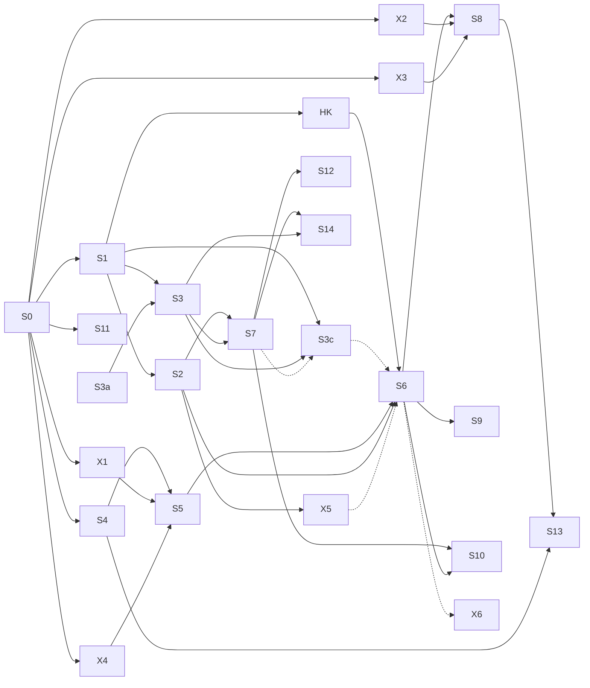

# 04: Studio roadmap

Each sub-project gets **one session cycle**: brainstorm, then a spec in `docs/superpowers/specs/`, then a plan in `docs/superpowers/plans/`, then implementation, then review. Keep each PR (checkpoint) to one item.

This list is mirrored in the root `ROADMAP.md` as "Phase 6 — Studio" (added in the 2026-09-29 kickoff review). Tick items in both.

- **Spikes (X*)** are throwaway. Their output is measured numbers and a recommendation written back into `03-tools-and-models.md`, never kept code.
- Spikes can run in parallel with the S items they don't block.

## Dependencies

Two paths leave S0. **Wave 1** (more clip accounts) is S0 → S1, then S2 and S3 in parallel. **founder.tapes and hombre.en.construccion launch only with S2** (ADR-48): assisted posting doesn't fit the owner's ~20-minute daily attention budget, so S2 comes first after S1's rollout. The **hooks card** (HK: the hook library, ADR-50) follows S1's rollout and lands before S6, so the story producer uses hook patterns from its first video. The dashboard shell (S3a) needed nothing; it is built, and its Vercel deploy is card 004. Nothing waits for posting experience: S1 starts once S0's code is finished (owner decision, 2026-09-29). **Wave 2** (the first AI account) is S0 → S4 → S5 → S6 with X1 and X4, and it also needs S2. S4 and X1 are done; run X4 (card 012) alongside S1–S3, then S5, so S6 can start as soon as S2 is done. X5 needs about 200 labeled verdicts, which only exist after some weeks of S0–S2 review. S3b needs nothing. **S3c** (account workspaces: versioned categories, blueprints and accounts, experiments, notes) starts once S1 is finished and S3's `admin` endpoint exists; its producer contract should land before S6 (dotted edge), and S7 later adds engagement metrics to its results (dotted edge).

## S0: Finish what's in flight (S1 starts once this code is finished)
- [x] Plan C, Telegram posting assistant: Task 4 (taps and commands), Task 5 (cron and docs), Task 6 (ADR-24 Dict keep-alive). Then the final review.
- [x] Deploy plans A, B and C together (done 2026-09-29; redeployed 2026-09-30 by S1 with the owner's OK, including the PyAV pin). Set `POSTING_CHAT_ID`, `POSTING_TIMEZONE`, `POSTING_SLOTS` and `POSTING_HASHTAGS` in `clipforge-secrets`. Run `clipforge set-webhook` and `clipforge status --rebuild`. Create `videos/billy-garton/` and `videos/channels.toml`, then `clipforge clip`.
- [ ] Background check, not a gate: realtalk.clipsdaily posts daily through the assistant; after 7 days, confirm the posting state survived. Reject reasons feed later tuning.
- **Exit:** clips reach the phone on schedule and the taps update the status.

## S1: Foundations: accounts, database, content items
The code for the open items below is built (card 002, PR #5) and deployed Dict-only on 2026-10-02. They are ticked at the rollout: **card 010** (Task 22, runbook §4c).
- [x] ADR-25, ADR-26 and ADR-35 accepted (2026-09-29 kickoff review).
- [ ] Neon Postgres with SQLAlchemy 2, psycopg 3 and Alembic. `DATABASE_URL` in the Modal secret. Tests run on a local Postgres (`TEST_DATABASE_URL`, or Docker through testcontainers).
- [ ] New contracts: `Account`, `PlatformProfile`, `BrandKit`, `Persona`, `AssetSource`, `ContentItem`. `channels.toml` sources move into `sources`, with an import command.
- [ ] Posting queue moves from Dict keys to `posts` rows, keeping the ADR-23 status rules. A one-off import (dry run, count check) brings over the existing `post:*` keys, and a `jobs` table is backfilled from each job's `metadata.json`. A setting switches reads between the Dict and Postgres, so rollback is a config change. The daily cron stays as `posting_daily` (ADR-46); only its Dict touch retires after a week on Postgres.
- [ ] Alembic runs in the CI deploy job before `modal deploy` (ADR-16). DB tests start Postgres with testcontainers (Docker), locally and in CI.
- [ ] Clip producer output wrapped into `ContentItem`s. realtalk.clipsdaily becomes account #1.
- [ ] Blueprints (`blueprints/<name>.toml`, versioned) and `clipforge account create --blueprint --lang --handle`. Write the three clip blueprints from 07.
- [ ] Campaign sources (e.g. Whop Content Rewards): required tags and links, and a submission list.
- [ ] Items deferred from S0's final review: a tap reads one clip's rows instead of scanning the whole Dict; a tap on an older message of a re-sent clip redraws every message of that clip, not just the tapped one.
- [ ] `producer_version` derived from the stage versions, prompt names and models; the git SHA only as `build` (ADR-43; replaces #85's rule).
- [ ] Slot guard: the tick skips a slot that already has a send, so a claim-key change can't double-send (#77). Until it's verified, the deploy blackout in runbook §1 applies.
- [ ] `posting/actions.py`: one backend for posted, skip, reject, reason, pause and next, with an actor on every write, used by the webhook and later by the admin routes (ADR-44).
- [ ] Ops alerts for silent failures and the daily reconcile `posting_daily` (ADR-45, ADR-46).
- [ ] Task 21 split: 21a (blueprints mounted, a read-only `db_doctor` Modal check, `.env.example`) before 21b (the database wired into `build_deps`, deployed only at rollout step 4c.2).
- [ ] Rollout rule: only realtalk.clipsdaily is created and hand-posted until S2; founder.tapes and hombre.en.construccion are created just before S2 (#106, refined by #135 and ADR-48).
- **Exit:** everything from S0 works the same, but state lives in Postgres and any number of accounts can be defined.

## S2: Publishing: Upload-Post, review tiers, policy gate
Design and plan: **card 011** (running). The build is a later card, after the rollout.
- [ ] `Publisher` protocol, with `UploadPostPublisher` (primary) and `AssistedPublisher` (today's Telegram flow).
- [ ] Media for Upload-Post: a signed, expiring per-file link from the Volume (ADR-13's mechanism). R2 only if that proves unreliable, or when the dashboard needs it (S3).
- [ ] Signed webhook route updates `posts`. Per-platform AI-disclosure mapping.
- [ ] Review tiers per account (`review`, `sample`, `auto`). Batch review in the dashboard; Telegram review cards (✅ / 🗑 / Open) only for items due within 2 h; copy fixes only in the dashboard (ADR-44).
- [ ] Notification policy and the 09:00 digest, quiet hours 23:00–08:00, deduped alerts (ADR-45).
- [ ] The brake (`/pause`) survives a Neon outage (a Dict key checked by every tick and publish) and cancels posts already scheduled at Upload-Post.
- [ ] One claim per (item, platform), so the AssistedPublisher fallback and Upload-Post can never both publish the same item; the fallback runs only after Upload-Post's final failure.
- [ ] Policy gate v1, pure checks only: disclosure flags, #ad, credits, license manifest, cross-account duplicates. (The banned-claims check comes with the Judge in S6: clips make no product claims.)
- [ ] Tracking links: `GET /go/<slug>`, click logging, and sub-ids per item and platform.
- [ ] Autopilot (ADR-48): the `autopilot` table with its append-only change history (one writer, `accounts/autopilot.py`), the Review dial and the Publish switch per account, presets, the graduation ladder (suggest; the owner taps), automatic demotions, the spot-check floor (at least 1 in 10 and 3 a week).
- [ ] Review windows: the first 10 items after a format change, the first 5 per account after a `producer_version` change (ADR-49), the first 10 dubs in a pair (read by S10).
- [ ] The brake's scope: `/pause <account>` and `/pause all` as one Dict key with a scope (the item above).
- [ ] Telegram one-tap only for review items due within 2 h (approve or reject) and the brake (#427); every other message carries Open → `/act/<kind>/<id>`.
- [ ] Publishing-failure rows (`publish_failed`, `publisher_disconnected`, `strike` where Upload-Post reports it) as instant alerts and "needs me" rows.
- [ ] One dispatcher cron (ADR-27, accepted with this card) replaces `posting_tick` and runs the 09:00 digest and the alert fold (S3 dashboard spec §8.1); `sweeper` and `posting_daily` stay: 3 crons.
- [ ] Migrations follow the landing-order rule (S3 dashboard spec §8.7): the first new migration also carries `jobs.error`, the `post_events.actor` column and the pause actor.
- **Exit:** realtalk.clipsdaily auto-posts to 4 platforms from its profile on its rung; founder.tapes and hombre.en.construccion are created just before S2 (O3) and start Hands-on on S2's flow; every post and click is recorded.

## S3a: Dashboard shell (built; the Vercel deploy is card 004)
- [x] `web/` app: Next.js App Router, TypeScript, Auth.js (one owner), TanStack Query, UI kit, mobile layouts.
- [x] A typed client generated by hey-api from an OpenAPI file exported from today's API (a script or CI step; the docs routes stay off).
- [x] Pages over the current API, server-side with the bearer token: Home (posting progress per channel from `GET /posting`) and a job page (`GET /jobs/{id}`). Everything else is a placeholder.
- [ ] Deployed on Vercel Pro, with the environment documented in `web/README.md` (card 004).
- Touches only `web/` (plus the export script), so it can share the folder with the S0 and S1 sessions. The `admin` Modal endpoint waits for S3.
- **Exit:** you log in on the phone and see the live posting progress.

## S3: Dashboard v1 (Next.js on Vercel; after S1, alongside S2)
Design: **card 009** (done, PR #20; mockups in `docs/design/dashboard/`). The build card comes after the rollout.
- [ ] `web/` app: Next.js, Auth.js (one owner), TanStack Query, and a client generated by hey-api from the exported OpenAPI file (CI job).
- [ ] API additions: accounts, personas, items, posts, calendar, review actions, costs.
- [ ] Pages (08 §2 and §2c; S3 dashboard spec §7 and §10.2), for phone and laptop: Home ("needs me" with the attention meter, the fleet scoreboard, today's slots), `/act/<kind>/<id>`, review inbox, calendar, sources, produce (with the batch planner and the Jobs tab), Results (Costs; Stats and Money in S7), Settings, Accounts → Compare (a read view), and the account workspace's Overview, Autopilot and Activity tabs. API: `GET /needs` and its actions, the scoreboard, slots, activity, batches, costs, settings. The link-contract test, and ops alerts with Open buttons. The Accounts page (studio map and account workspaces) moved to **S3c** (owner decision, 2026-09-30). Until S2 adds approve-to-publish, posting stays in the Telegram assisted flow and the review inbox is a queue manager (skip, reject, reorder, posted correction through `posting/actions.py`; D8). Decisions comes in S6; Stats, Money and Personas in S7/S8.
- [ ] Vercel Pro project. Modal proxy auth plus bearer token from server route handlers, to `admin`: a second `@modal.asgi_app(requires_proxy_auth=True)` that reuses `create_app` with an admin router and its own `ADMIN_API_TOKEN` (D9).
- **Exit:** the owner runs the daily check-in from the phone in under 20 minutes, every Telegram alert opens its row in `/act`, and the laptop is needed only for `clipforge fetch`.

## S3c: Account workspaces (after S1 and S3's admin endpoint; ADR-42)
Amended 2026-10-01 by ADR-48 and ADR-50 (S3 dashboard spec §10.3): the review tier and the budget move out of the versioned setup into the `autopilot` table; the actor check allows `system:<component>`; the workspace gains the Style, Hooks and Activity tabs; Accounts gets the Map next to S3's Compare; hook metrics live on the Hooks tab, not in the experiment registry.
Spec: [docs/superpowers/specs/2026-09-30-studio-s3-workspaces-design.md](../superpowers/specs/2026-09-30-studio-s3-workspaces-design.md). Versioned categories, blueprints and accounts in the database (ADR-42, replacing ADR-35's "blueprints are files"), with notes, experiments and results. The implementation plan is written once S1 is finished.
- [ ] **S3c-1, versions and workspaces:** its migration, the next in landing order (S3 dashboard spec §8.7) (categories, versions, experiments, notes, `content_items.setup_version`, `post_events.actor`), the resolver and field registry, `POST /setup/preview` (the one dry run for saves and experiment starts), `clipforge setup import` / `setup verify` (S1's blueprints and accounts as version 1), the category, blueprint and account workspaces (setup with origins, history, diff, restore), notes, the Accounts page. `SETUP_SOURCE=off`: edit and review only.
- [ ] **S3c-2, wiring into the clip producer** (needs S1 Tasks 14, 15, 17 and 21 live): `create_job` reads and stamps the setup, items and sends record their version, caption preset in the captions key (only when not `default`), prompts from released versions, the language-mismatch hold. `SETUP_SOURCE=db` after `verify` reports 0 differences.
- [ ] **S3c-3, experiments and results:** the experiment flow and page (the only place to keep or revert) with the re-cut estimate, one running experiment per account, results with the metrics available now (posted, skipped, rejected and reasons, cost, holds), the "too few items" warning, the Experiments nav item, Home's "Needs a decision" card, learnings in the category playbook.
- [ ] (In S7) views, retention, followers, clicks and revenue join the metric registry.
- **Exit:** the owner changes realtalk's max clip length through an experiment, sees before and during for reject rate and posted rate, chooses Keep, and the learning shows in the clips playbook; all from the dashboard, on phone and laptop.

## S3b: Notion mirror (small; can run right after the kickoff review)
- [ ] One-way copy of `docs/studio/*` into a "ClipForge Studio" Notion parent with the Notion connector (prompt G), no code. The pages say "read-only mirror, edit in repo". A `clipforge notion sync-docs` command waits for the weekly report.
- [ ] A weekly report page, generated from Postgres by the dispatcher (after S7 has metrics).
- **Exit:** the owner reads the plan and weekly results in Notion on the phone, and nothing flows back from Notion.

## X1 to X4: Media spikes (parallel with S2/S3; throwaway)
- [x] **X1, voice:** Qwen3-TTS VoiceDesign vs Kokoro vs Chatterbox, in English and Spanish. Blind listening test on 10 scripts. Measure GPU-seconds, cold start and batched throughput on L4.
  - **Done 2026-09-30:** Qwen3-TTS Base (cloning a VoiceDesign reference) is the primary, Kokoro-82M the fallback, and Chatterbox is out.
  - S5's TTS server runs Qwen **unbatched behind the guard** (token cap, duration check, a WER check that shares the caption faster-whisper pass, one retry). Batching comes back only after a guarded re-test.
  - Numbers are in 03; the report is [spikes/x1-voice.md](spikes/x1-voice.md).
- [ ] **X2, talking head:** InfiniteTalk vs LongCat-Avatar 1.5 vs EchoMimicV3, on 3 synthetic personas × 20 s. Measure quality, lip sync in Spanish, GPU-seconds on H100/A100, the upscale path to 1080x1920, and the license/InsightFace check.
  - Started 2026-09-30, stopped at ~25% by the pause (licenses checked, no clips yet, ~$0.40 spent). Findings and the resume recipe: [spikes/x2-talking-head.md](spikes/x2-talking-head.md). Waiting on the owner's WenetSpeech ruling (log O7); it resumes as card 005.
- [ ] **X3, persona:** Z-Image-Turbo portrait, then a LoRA trained on H100. Check identity consistency across 30 images, and time and cost per persona.
- [ ] **X4, visuals and music:** Z-Image stills on L4 FP8 vs L40S. Wan2.2 5 s b-roll cost. ACE-Step music bed quality.
- [ ] **X5, Judge:** TypeSafe Jev vs Haiku on ~200 labeled items (owner verdicts plus synthetic policy cases, in English and Spanish). Measure accuracy, calibration curves and cost. Needs Jev early access, so join the waitlist now.
- [ ] **X6, hero shots (optional):** Grok Imagine Video 1.5 vs Wan2.2 on 10 story shots. Compare quality, cost per second, and later retention A/B.
- **Exit:** 03 is updated with measured costs, and each primary model is confirmed or swapped.

## S4: Timeline renderer
- [x] `Timeline` contract. `render` is generalized to visual segments (source crop, still with Ken Burns, video clip, talking head), audio tracks (narration, source, music bed with ducking) and captions/title card.
- [x] The clip producer is moved onto the Timeline, and its output properties must stay identical (ffprobe asserts).
- **Exit (met 2026-10-01, card 006, PR #13, deployed):** one renderer produces both a clip and a synthetic test Timeline at 1080x1920 and under 50 MB, with two-pass loudness (ADR-47).

## HK: Hook library (after S1's rollout, before S6; ADR-50)
Its card is written after the rollout.
- [ ] Pattern versions (append-only), item stamping (`hook_pattern_id@version` and the weights in force), 2–3 variants per item in the clips producer (one Haiku call, about $0.0025 per item; the captions prompt bump opens ADR-49's window), weighted rotation frozen during experiments, ranking before S7 (owner 👍/👎, approval and reject rates) and after S7 (3-second hold, views at 24 h), admin routes and the Hooks tab. Outline: S3 dashboard spec §8.5.
- **Exit:** every new clip records its hook pattern and version, and the Hooks tab ranks patterns per account.

## S5: Media servers and producer registry
- [ ] `media/` protocols plus `registry.toml` with a license-allowlist test. A `clipforge-models` Volume with one-off weight download functions.
- [ ] `modal.Cls` servers for TTS, aligner, image and music (from X1/X4), using memory snapshots, `@modal.batched` (except TTS: Qwen3-TTS runs unbatched behind the guard until batching is re-tested under it, per X1) and step methods inside the class.
- [ ] Pipeline registry: `dispatch()` and `resume()` are driven by per-producer step lists. `app.py` splits into a `modal_app/` package (still the only Modal importer).
- [ ] LLM tracing in Langfuse.
- **Exit:** the clip producer runs through the registry, and a no-op "hello" producer proves the GPU step pattern.

## S6: Story producer (first AI account live)
- [ ] Brief (niche, topic list, research sources) → script (versioned prompt, several structures) → pre-check → TTS → align → shot plan → stills and optional b-roll → music → Timeline → render → gate → item.
- [ ] `Judge` protocol (ClaudeJudge first, JevJudge after X5) for the banned-claims gate check and review routing (ADR-36).
- [ ] Decision ledger (`decisions` table), lanes (publish / review / fix / reject), fail-closed rules, audit sampling of the `publish` lane, and the Telegram morning message (08 §1, ADR-37).
- [ ] Variation engine: script structure, voice style, pacing and visual style are rotated and logged per item (against the inauthentic-content rule).
- [ ] Persona voice per account (VoiceDesign, then a stored reference clip).
- [ ] An eval set for scripts: 20 topics with an LLM-judge rubric plus owner ratings (docs/EVALS.md style).
- [ ] Weekly trend job per blueprint (xAI X Search plus YouTube `mostPopular` and comments), feeding topic lists.
- [ ] RIFE to 30 fps for generated video, caption presets (pycaps effects ported to ASS, Noto Emoji). (Two-pass loudnorm shipped with S4, ADR-47.)
- [ ] The queue filler (the Produce switch, ADR-48) as a generic `produce/filler.py` with a clips adapter, and the hard spend caps in `service.create_job` if no earlier card creates jobs automatically. Story hook variants through the hooks card's interface (ADR-50).
- **Exit:** wave 2, **untold.archive + historias.ocultas**, posts 1–2 videos a day each at 61–90 s, in `review` tier, costing under $0.10 per video.

## S7: Analytics and money
- [ ] Daily pull (Upload-Post analytics, plus YouTube Analytics where connected) into metrics tables.
- [ ] `programs` table (YPP, TikTok Rewards, Facebook CMP, Skool, …) with editable thresholds. Progress per account.
- [ ] Conversion import: ClickBank and Hotmart APIs, CSV upload for Skool, Amazon and TikTok Shop.
- [ ] Dashboard: stats, monetization progress, revenue vs cost per account, winners.
- [ ] Spend reporting per account and stage, and budget burn-down (the hard caps are enforced in `create_job` from the first automatic job creator, ADR-48). Sentry wired in.
- [ ] The analytics pull, program progress and view-collapse checks run as dispatcher tasks (the dispatcher arrives with S2, ADR-27). Hook ranking adds the 3-second hold and views at 24 h (ADR-50).
- **Exit:** the owner sees cost, views, clicks and revenue per account and per video.

## S8: Avatar producer + personas
- [ ] `persona` producer: face with a LoRA (from X3) plus voice, stored and reusable.
- [ ] Avatar producer: offer brief (product, infoproduct or Skool, plus a tracking link), a script that never claims first-person use, a claims pre-check, a talking head **for presenter segments only**, b-roll, render, and a gate that requires #ad and the AI flag.
- **Exit:** wave 3, **profe.ia.ingles** and **ai.tools.lab**, posts daily at under $0.30 per video, and every video carries a tracked link.

## S9: Band producer
- [ ] Research (MusicBrainz, Wikidata, Wikipedia), Commons photo sourcing with attribution, a promo-material intake with the permission recorded, art generation (no photoreal images of real people), music-free master plus `suggested_sound`, and collab tagging in the copy.
- **Exit:** wave 4, **neverheard.from** and **radar.indie.latino**, posts daily, and every asset has a license record.

## S10: Dub winners (EN ↔ ES)
- [ ] Winner detection feeds the `dub` producer: translation within a timing budget, the target persona's voice, re-timed captions, and a re-rendered talking head for avatars. The result posts to the paired account. Rules (ADR-48): only to a paired account, only when the source permission allows translation, under the target account's dial and budget, and the first 10 dubs in a pair go to review.
- **Exit:** the top-decile videos of one EN account appear on its ES partner account within 48 h.

## S11: Local fetch helper (small; can land any time after S0)
- [ ] `clipforge fetch <url> --channel <c>`: yt-dlp with Deno and the bgutil PO-token plugin, saving into `videos/<channel>/`. Permission is checked against the `sources` rows.

## S12: The Desk (inbound triage, after S7)
- [ ] Event sources: comments and DMs (posting provider or platform APIs), a shared inbox for brand deals and band submissions, Whop campaign listings, trend items.
- [ ] Judge questions (lane, urgency, evidence, money) with guards. Claude drafts go into the queue, never auto-sent. 1% audit of `ignore`.
- **Exit:** the owner handles inbound for all accounts from one Desk page. The audit shows the false-ignore rate.

## S13: AI model / influencer producer (category E)
- [ ] `ContentItem` media kinds `carousel` and `image`, and a carousel renderer (1080x1350 and 1080x1920 frames, captions and copy).
- [ ] Persona scenes: LoRA-driven stills (Z-Image), consistency check, short motion reels (Wan2.2 image-to-video or InfiniteTalk). Provenance metadata kept.
- [ ] Compliance profile: AI bio and labels, synthetic-only training data, sponsored disclosure, no health or diet claims.
- **Exit:** wave 6, one AI-model persona, posts daily carousels and reels in `review` tier.

## S14: Funnel and own products (planned now, built later)
- [ ] Link-in-bio pages per account (Vercel, Umami), email capture, an email provider, a sequence builder.
- [ ] Sales import (Hotmart API, Skool CSV, Gumroad) and a Funnel page.
- [ ] First product: an outline and lessons produced by the studio (e.g. profe.ia.ingles on Hotmart), with guardrails (08 §5).

## Later
- Official YouTube and Instagram publishers (free, higher limits). Keep Upload-Post for TikTok.
- YouTube long-form compilations for story accounts once they're in YPP.
- Phase 5 ranker trained on reject reasons, retention and conversions.
- Own Skool community as the shared funnel.
- Modal Team plan, once concurrency or the cron limit bites.
- LLM router over free tiers for bulk text (ADR-32), if LLM spend passes $50/month.
