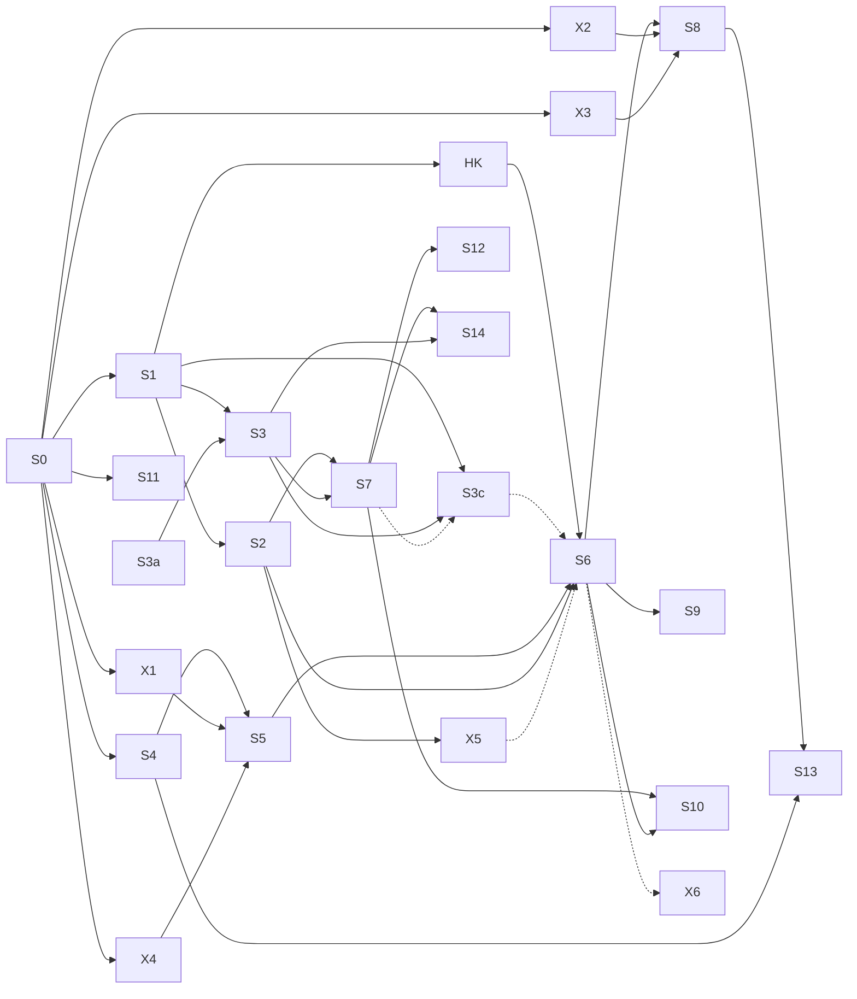

# 04: Studio roadmap

Each sub-project gets **one session cycle**: brainstorm, then a spec in `docs/superpowers/specs/`, then a plan in `docs/superpowers/plans/`, then implementation, then review. Keep each PR (checkpoint) to one item.

This list is mirrored in the root `ROADMAP.md` as "Phase 6 — Studio" (added in the 2026-09-29 kickoff review). Tick items in both.

- **Spikes (X*)** are throwaway. Their output is measured numbers and a recommendation written back into `03-tools-and-models.md`, never kept code.
- Spikes can run in parallel with the S items they don't block.

## Dependencies

Two paths leave S0. **Wave 1** (more clip accounts) is S0 → S1, then S2 and S3 in parallel. **founder.tapes and hombre.en.construccion launch only with S2** (ADR-48): assisted posting doesn't fit the owner's ~20-minute daily attention budget, so S2 comes first after S1's rollout. The **hooks card** (HK: the hook library, ADR-50) follows S1's rollout and lands before S6, so the story producer uses hook patterns from its first video. The dashboard shell (S3a) needed nothing; it is built, and its Vercel deploy is card 004. Nothing waits for posting experience: S1 starts once S0's code is finished (owner decision, 2026-09-29). **Wave 2** (the first AI account) is S0 → S4 → S5 → S6 with X1 and X4, and it also needs S2. S4 and X1 are done; run X4 (card 012) alongside S1–S3, then S5, so S6 can start as soon as S2 is done. X5 needs about 200 labeled verdicts, which only exist after some weeks of S0–S2 review. S3b needs nothing. **S3c** (account workspaces: versioned categories, blueprints and accounts, experiments, notes) starts once S1 is finished and S3's `admin` endpoint exists; its producer contract should land before S6 (dotted edge), and S7 later adds engagement metrics to its results (dotted edge).

## S0: Finish what's in flight (S1 starts once this code is finished)
- [x] Plan C, Telegram posting assistant: Task 4 (taps and commands), Task 5 (cron and docs), Task 6 (ADR-24 Dict keep-alive). Then the final review.
- [x] Deploy plans A, B and C together (done 2026-09-29; redeployed 2026-09-30 by S1 with the owner's OK, including the PyAV pin). Set `POSTING_CHAT_ID`, `POSTING_TIMEZONE`, `POSTING_SLOTS` and `POSTING_HASHTAGS` in `clipforge-secrets`. Run `clipforge set-webhook` and `clipforge status --rebuild`. Create `videos/billy-garton/` and `videos/channels.toml`, then `clipforge clip`.
- [ ] Background check, not a gate: realtalk.clipsdaily posts daily through the assistant; after 7 days, confirm the posting state survived. Reject reasons feed later tuning.
- **Exit:** clips reach the phone on schedule and the taps update the status.

## S1: Foundations: accounts, database, content items
Built by card 002 (PR #5), deployed Dict-only on 2026-10-02, and rolled out by **card 010** on 2026-10-05 (Task 22, runbook §4c): production reads the posting queue from Postgres (`STATE_READS=postgres`), with `posting verify` at 0 differences (log #223). Only the ADR-24 retirement (Task 23) is open.
- [x] ADR-25, ADR-26 and ADR-35 accepted (2026-09-29 kickoff review).
- [x] Neon Postgres with SQLAlchemy 2, psycopg 3 and Alembic. `DATABASE_URL` in the Modal secret. Tests run on a local Postgres (`TEST_DATABASE_URL`, or Docker through testcontainers).
- [x] New contracts: `Account`, `PlatformProfile`, `BrandKit`, `Persona`, `AssetSource`, `ContentItem`. `channels.toml` sources move into `sources`, with an import command.
- [x] Posting queue moves from Dict keys to `posts` rows, keeping the ADR-23 status rules. A one-off import (dry run, count check) brings over the existing `post:*` keys, and a `jobs` table is backfilled from each job's `metadata.json`. A setting switches reads between the Dict and Postgres, so rollback is a config change. The daily cron stays as `posting_daily` (ADR-46).
- [x] Alembic runs in the CI deploy job before `modal deploy` (ADR-16; the CI deploy job stays off until `DEPLOY_ENABLED` is set, so the owner migrates by hand, runbook §4c step 1). DB tests start Postgres with testcontainers (Docker), locally and in CI.
- [x] Clip producer output wrapped into `ContentItem`s. realtalk.clipsdaily becomes account #1.
- [x] Blueprints (`blueprints/<name>.toml`, versioned) and `clipforge account create --blueprint --lang --handle`. Write the three clip blueprints from 07.
- [x] Campaign sources (e.g. Whop Content Rewards): required tags and links, and a submission list.
- [x] Items deferred from S0's final review: a tap reads one clip's rows instead of scanning the whole Dict; a tap on an older message of a re-sent clip redraws every message of that clip, not just the tapped one.
- [x] `producer_version` derived from the stage versions, prompt names and models; the git SHA only as `build` (ADR-43; replaces #85's rule).
- [x] Slot guard: the tick skips a slot that already has a send, so a claim-key change can't double-send (#77). Until it's verified, the deploy blackout in runbook §1 applies.
- [x] `posting/actions.py`: one backend for posted, skip, reject, reason, pause and next, with an actor on every write, used by the webhook and later by the admin routes (ADR-44).
- [x] Ops alerts for silent failures and the daily reconcile `posting_daily` (ADR-45, ADR-46).
- [x] Task 21 split: 21a (blueprints mounted, a read-only `db_doctor` Modal check, `.env.example`) before 21b (the database wired into `build_deps`, deployed only at rollout step 4c.2).
- [x] Rollout rule: only realtalk.clipsdaily is created and hand-posted until S2; founder.tapes and hombre.en.construccion are created just before S2 (#106, refined by #135 and ADR-48).
- [ ] ADR-24 retires (Task 23): after 7 days in a row on Postgres with `posting_daily: verify` at 0 differences (from 2026-10-06), a later session removes the Dict copy of the queue and `posting_daily`'s Dict touch, snapshot and verify.
- **Exit:** everything from S0 works the same, but state lives in Postgres and any number of accounts can be defined.

## S2: Publishing: Upload-Post, review tiers, policy gate
Design and plan: **card 011**, done 2026-10-02 (PR #27): the spec `docs/superpowers/specs/2026-10-01-studio-s2-design.md` and the plan `docs/superpowers/plans/2026-10-02-studio-s2.md`. The build is three cards, each one PR or more and deployable alone: **014** (S2a), **015** (S2b) and **016** (S2c), after card 010's rollout. ADR-27 (the dispatcher) and ADR-33 (tracking links) are accepted. **Updated 2026-10-05 (ADR-54): Telegram is notifications only.** Assisted posting is paused; reviews happen only on the dashboard, so **S2b (card 015) starts after card 024 (S3-3, the Review page) is deployed**. Build order: 010 → 014 → 031 → 004 → 022 → 023 → 024 → 015 → 016, one deploy at a time (#144).

**S2a: rails** (card 014, plan Tasks 1–8; the assisted flow is unchanged and stays paused, ADR-54):
- [ ] Migrations follow the landing-order rule (S3 dashboard spec §8.7): migration 0002 also carries `jobs.error`, the `post_events.actor` column (backfilled from `data.actor`) and the pause actor on `posting_state`.
- [ ] One dispatcher cron (ADR-27) replaces `posting_tick`; it runs the alert fold now, and the slot phases and the 09:00 digest as S2b and S2c add them (S3 dashboard spec §8.1); `sweeper` and `posting_daily` stay: 3 crons.
- [ ] The brake (`/pause`) survives a Neon outage: a Dict key checked by every tick and publish. Its scope: `/pause <account>` and `/pause all` as one Dict key with a scope (`brake:<scope>`).
- [ ] Autopilot (ADR-48), first part: the `autopilot` table with its append-only change history (one writer, `accounts/autopilot.py`), the Publish switch and presets; every account starts Hands-on. `clipforge autopilot show|set|preset`.
- [ ] Policy gate v1, pure checks only: disclosure flags, #ad, credits, license manifest, cross-account duplicates. (The banned-claims check comes with the Judge in S6: clips make no product claims.) Log-only behind `GATE_ENFORCE=off` until S2b's `clipforge policy dry-run` reports 0 items held (#461).
- [ ] Routing and review windows: the first 10 items after a format change, the first 5 per account after a `producer_version` change (ADR-49), the first 10 dubs in a pair (read by S10).

**S2b: Upload-Post for realtalk on Hands-on** (card 015, plan Tasks 9–19; after card 024 is deployed, ADR-54). Its build starts after one real Upload-Post call confirms the idempotency-key retention, Basic's rate limit and how soon a scheduled upload is visible (R5, plan Task 9, #458):
- [ ] `Publisher` protocol, with `UploadPostPublisher` (the only implementation; `AssistedPublisher` dropped by ADR-54).
- [ ] Media for Upload-Post: a signed, expiring per-file link from the Volume (ADR-13's mechanism). R2 only if that proves unreliable, or when the dashboard needs it (S3).
- [ ] Signed webhook route updates `posts`. Per-platform AI-disclosure mapping.
- [ ] One claim per (item, platform), so an item is never published twice; a confirmed final failure is an alert and a failure row, never a manual post card (ADR-54). Reconcile and crash recovery (no re-send until R5 allows it).
- [ ] The slot plan and hand-off 30 minutes before the slot; the brake cancels posts already scheduled at Upload-Post.
- [ ] Review tiers per account (`review`, `sample`, `auto`). Every review decision and copy fix on the dashboard's Review page; Telegram sends one notification, "N items need review → Open", for items due within 2 h (ADR-54; the 09:00 review batch and `REVIEW_BATCH` are removed, log #150).
- [ ] Telegram is notifications only (ADR-54): alerts, the digest, `/status` and the brake; no one-tap decisions; every alert carries Open → `/act/<kind>/<id>`. The `assisted` dispatcher task is unregistered (dormant code); realtalk moves to Upload-Post.

**S2c: the rest of autopilot, and the launches** (card 016, plan Tasks 21–26; waits on O3):
- [ ] Autopilot, second part: the Review dial (`sample` and `auto` end to end), the graduation ladder (suggest; the owner taps, by CLI until S3), automatic demotions, the spot-check floor (at least 1 in 10 and 3 a week). Strikes are entered by hand (`clipforge autopilot strike` in S2, S3's form later): Upload-Post documents no strike event (#450).
- [ ] Notification policy and the 09:00 digest, quiet hours 23:00–08:00, deduped alerts (ADR-45). Planning and the digest run in the owner's time zone (#455).
- [ ] Publishing-failure rows (`publish_failed`, `publisher_disconnected`, `strike` entered by hand) as instant alerts and "needs me" rows.
- [ ] Tracking links (ADR-33): `GET /go/<slug>`, click logging, and sub-ids per item and platform.
- [ ] founder.tapes and hombre.en.construccion created (O3), with one permitted source each and their own Upload-Post profiles, starting Hands-on.
- **Exit:** realtalk.clipsdaily auto-posts to 4 platforms from its profile on its rung; founder.tapes and hombre.en.construccion are created just before S2 (O3) and start Hands-on on S2's flow; every post and click is recorded.

## S3a: Dashboard shell (done: deployed on Vercel by card 004, 2026-10-05)
- [x] `web/` app: Next.js App Router, TypeScript, Auth.js (one owner), TanStack Query, UI kit, mobile layouts.
- [x] A typed client generated by hey-api from an OpenAPI file exported from today's API (a script or CI step; the docs routes stay off).
- [x] Pages over the current API, server-side with the bearer token: Home (posting progress per channel from `GET /posting`) and a job page (`GET /jobs/{id}`). Everything else is a placeholder.
- [x] Deployed on Vercel Pro (`https://clipforge-web-brown.vercel.app`), with the environment documented in `web/README.md` (card 004, 2026-10-05).
- Touches only `web/` (plus the export script), so it can share the folder with the S0 and S1 sessions. The `admin` Modal endpoint waits for S3.
- **Exit:** you log in on the phone and see the live posting progress.

## S3: Dashboard v1 (Next.js on Vercel; after S1, alongside S2)
Design: **card 009** (done, PR #20; mockups in `docs/design/dashboard/`). Plan: **card 019** (done, PR #38): spec §11 (the delta after S2's plan) and `docs/superpowers/plans/2026-10-02-studio-s3-dashboard.md`. Built in six checkpoints, S3-1 to S3-5b (spec §11.3), each its own card, gated on the earlier card being **deployed** (#144, #623); online use needs card 004, which now comes before 022 (ADR-54: cards 022–024 run before S2b, since publishing waits for the Review page): **022** (S3-1: the `admin` endpoint, proxy auth, S3's migration, Settings; after card 010 is done and card 014 is deployed), **023** (S3-2: needs, Home, `/act`), **024** (S3-3: Review and Calendar), **025** (S3-4: Produce, Jobs, Sources), **026** (S3-5: Results → Costs, Compare, the account view) and **027** (S3-5b: the Telegram retirements and the CLI cut-over, after their 7-day windows).
- [ ] `web/` app: Next.js, Auth.js (one owner), TanStack Query, and a client generated by hey-api from the exported OpenAPI file (CI job).
- [ ] API on the `admin` endpoint (all under `/admin/`): the needs API, scoreboard, slots, compare, account overview, activity, sources and episodes, batches, jobs list, costs, settings, the pin and posting actions, batch approve, strikes, pause. S2's autopilot, review, policy, publisher and link routes are reused, never duplicated (spec §11.1).
- [ ] Pages (08 §2 and §2c; S3 dashboard spec §7, §10.2 and §11), for phone and laptop: Home ("needs me" with the attention meter, the fleet scoreboard, today's slots), `/act/<kind>/<id>`, review inbox, calendar, sources, produce (with the batch planner and the Jobs tab), Results (Costs; Stats and Money in S7), Settings, Accounts → Compare (a read view), and the account view's Overview, Autopilot and Activity tabs. The link-contract test, and ops alerts with Open buttons. The studio map and account workspaces are **S3c** (owner decision, 2026-09-30). Review has two tabs: Queue (D8's queue manager for assisted accounts, through `posting/actions.py`, including move to the front) and Review lane (S2's routes, plus batch approve). Re-render ships disabled until the hooks build adds its route. Calendar has no drag-to-reschedule in S3 (log #146: a later card, after S2b or with S7; its writers are `dispatch/plan.py` for one slot and the accounts service for the schedule). Decisions comes in S6; Stats and Money in S7; Personas in S8.
- [ ] Vercel Pro project with `ADMIN_API_URL`, `ADMIN_API_TOKEN`, `MODAL_PROXY_KEY`, `MODAL_PROXY_SECRET`; `admin` is a second `@modal.asgi_app(requires_proxy_auth=True)` reusing `create_app` with `surface="admin"` (D9). `web` keeps the public routes and, until S3-5b's CLI cut-over, the CLI's bearer routes (S2's `/admin/*` and S1's `/accounts`, `/sources`, `/jobs`, `/posting`); at the cut-over all of them move to `admin` and `web` serves only the public routes (owner ruling, log #146).
- **Exit:** the owner runs the daily check-in from the phone in under 20 minutes, every Telegram alert opens its row in `/act`, and the laptop is needed only for `clipforge fetch`. `/clip` is retired after 7 days of Produce online (`REVIEW_BATCH` no longer exists, ADR-54).

## S3c: Account workspaces (after S1's rollout, with S2a and S3-1 deployed; ADR-42)
Amended 2026-10-01 by ADR-48 and ADR-50 (S3 dashboard spec §10.3), applied to the spec by card 018 (2026-10-02):
- The review tier and the budget move out of the versioned setup into the `autopilot` table.
- The actor check allows `system:<component>`.
- The workspace gains the Style, Hooks and Activity tabs.
- Accounts gets the Map next to S3's Compare.
- Hook metrics live on the Hooks tab, not in the experiment registry.
- Card 018 also renumbered the migration (landing order; `post_events.actor` is S2a's) and split S3c-1 in two (owner, log #257).

Spec: [docs/superpowers/specs/2026-09-30-studio-s3-workspaces-design.md](../superpowers/specs/2026-09-30-studio-s3-workspaces-design.md). Versioned categories, blueprints and accounts in the database (ADR-42, replacing ADR-35's "blueprints are files"), with notes, experiments and results. The implementation plan: [docs/superpowers/plans/2026-10-02-studio-s3c.md](../superpowers/plans/2026-10-02-studio-s3c.md) (four parts, 21 tasks).
Build cards (log #148): 035 S3c-1a (`s3c/data`), 036 S3c-1b (`s3c/pages`), 037 S3c-2 (`s3c/wiring`), 038 S3c-3 (`s3c/experiments`), one at a time, each after the previous one and its listed cards are deployed.
- [ ] **S3c-1a, data and routes** (after card 010, with S2a (card 014) and S3-1 (card 022, the `admin` endpoint) deployed):
  - its migration, the next in landing order (S3 dashboard spec §8.7): categories, versions, experiments, notes, `content_items.setup_version`, `accounts.current_version`; no deferred items;
  - the resolver and field registry, and the versions service (`format_changed`, the `accounts` projection);
  - `POST /setup/preview` (the one dry run for saves and experiment starts);
  - `clipforge setup import` / `setup verify` (S1's blueprints and accounts as version 1, the drafted category playbooks);
  - the admin routes, and `PATCH /accounts/{id}` writing versions.
  - `SETUP_SOURCE=off`; nothing visible yet.
- [ ] **S3c-1b, pages** (after S3c-1a and S3-5 (card 026, Compare and the account view) are deployed):
  - the Accounts Map and Compare's versions and experiment columns;
  - the category, blueprint and account workspaces (Style; Setup & History with origins, diff and restore);
  - notes.
  - `SETUP_SOURCE=off`: edit and review only.
- [ ] **S3c-2, wiring into the clip producer** (after S3c-1b is deployed):
  - `create_job` reads and stamps the setup; items record their version, and sends are attributed by their claim time;
  - the caption preset in the captions key (only when not `default`), and prompts from released versions;
  - the language-mismatch hold (the language is never a Whisper hint);
  - `SetupRepo.format_window` as S2's injected format-window source (wired in `runtime.build_deps`; no S2 module changes);
  - the Framing & captions tab.
  - `SETUP_SOURCE=db` after `verify` reports 0 differences.
- [ ] **S3c-3, experiments and results** (after S3c-2 and S2c (card 016) are deployed):
  - the experiment flow and page (the only place to keep or revert), with the re-cut estimate and autopilot markers;
  - one running experiment per account, and the hooks weight freeze through the `HookFreezer` protocol in `src/clipforge/hooks/freezer.py` (shared with HK-1; a no-op until the hooks build deploys);
  - results with the metrics available now (posted, skipped, rejected and reasons, cost, holds) and the "too few items" warning;
  - the Experiments nav item, the `experiment_decision` "needs me" row (an S3 needs provider), and `experiments.digest_line` as a digest provider (wired in `runtime.build_deps`);
  - learnings in the category playbook.
- [ ] (In S7) views, retention, followers, clicks and revenue join the metric registry.
- **Exit:** the owner changes realtalk's max clip length through an experiment, sees before and during for reject rate and posted rate, chooses Keep, and the learning shows in the clips playbook; all from the dashboard, on phone and laptop.

## S3b: Notion mirror (small; can run right after the kickoff review)
- [ ] One-way copy of `docs/studio/*` into a "ClipForge Studio" Notion parent with the Notion connector (prompt G), no code. The pages say "read-only mirror, edit in repo". A `clipforge notion sync-docs` command waits for the weekly report.
- [ ] A weekly report page, generated from Postgres by the dispatcher (after S7 has metrics).
- **Exit:** the owner reads the plan and weekly results in Notion on the phone, and nothing flows back from Notion.

## X1 to X4: Media spikes (parallel with S2/S3; throwaway)
- [x] **X1, voice:** Qwen3-TTS VoiceDesign vs Kokoro vs Chatterbox, in English and Spanish. Blind listening test on 10 scripts. Measure GPU-seconds, cold start and batched throughput on L4.
  - **Done 2026-09-30:** Qwen3-TTS Base (cloning a VoiceDesign reference) is the primary, Kokoro-82M the fallback, and Chatterbox is out.
  - S5's TTS server runs Qwen **unbatched behind the guard** (token cap, duration check, a WER check that shares the caption faster-whisper pass, one retry). Batching comes back only after a guarded re-test.
  - Numbers are in 03; the report is [spikes/x1-voice.md](spikes/x1-voice.md).
- [ ] **X2, talking head:** InfiniteTalk vs LongCat-Avatar 1.5 vs EchoMimicV3, on 3 synthetic personas × 20 s. Measure quality, lip sync in Spanish, GPU-seconds on H100/A100, the upscale path to 1080x1920, and the license/InsightFace check.
  - Started 2026-09-30, stopped at ~25% by the pause (licenses checked, no clips yet, ~$0.40 spent). Findings and the resume recipe: [spikes/x2-talking-head.md](spikes/x2-talking-head.md). Waiting on the owner's WenetSpeech ruling (log O7); it resumes as card 005.
- [ ] **X3, persona:** Z-Image-Turbo portrait, then a LoRA trained on H100. Check identity consistency across 30 images, and time and cost per persona.
- [x] **X4, visuals and music:** Z-Image stills on L4 FP8 vs L40S. Wan2.2 5 s b-roll cost. ACE-Step music bed quality.
  - **Done 2026-10-02 (card 012, about $5.5 of $15):** stills on Qwen-Image-2512 + Lightning (L40S, $0.0041 per image; Z-Image-Turbo the fallback, L4 FP8 dropped), b-roll on Wan2.2 I2V-A14B + lightx2v 4-step (H100, ~$0.10 per 5 s clip), music on ACE-Step 1.5 without thinking ($0.0031 per bed) as an owner-approved bank of beds per mood per account.
  - The first end-to-end samples failed on how the video was assembled, not on the models: S6's producer rules (one image per line, the hook frame, style lock, shot continuity and transitions, b-roll timing, captions from narration timings, bed level) and the renderer changes (configurable duck depth, Timeline transitions, captions for produced Timelines) are in [spikes/x4-visuals-music.md](spikes/x4-visuals-music.md). Numbers are in 03.
- [ ] **X5, Judge:** TypeSafe Jev vs Haiku on ~200 labeled items (owner verdicts plus synthetic policy cases, in English and Spanish). Measure accuracy, calibration curves and cost. Needs Jev early access, so join the waitlist now.
- [ ] **X6, hero shots (optional):** Grok Imagine Video 1.5 vs Wan2.2 on 10 story shots. Compare quality, cost per second, and later retention A/B.
- **Exit:** 03 is updated with measured costs, and each primary model is confirmed or swapped.

## S4: Timeline renderer
- [x] `Timeline` contract. `render` is generalized to visual segments (source crop, still with Ken Burns, video clip, talking head), audio tracks (narration, source, music bed with ducking) and captions/title card.
- [x] The clip producer is moved onto the Timeline, and its output properties must stay identical (ffprobe asserts).
- **Exit (met 2026-10-01, card 006, PR #13, deployed):** one renderer produces both a clip and a synthetic test Timeline at 1080x1920 and under 50 MB, with two-pass loudness (ADR-47).

## HK: Hook library (after S1's rollout, before S6; ADR-50)
Designed and planned by card 020 ([spec](../superpowers/specs/2026-10-02-studio-hooks-design.md), [plan](../superpowers/plans/2026-10-02-studio-hooks.md); log #550–#562). Its build card starts after card 010 and lands its migration after card 014's (landing order: S2a's 0002, then whichever of hooks, S3 and S3c is next). Three deployable parts.
Build cards (log #148): 028 HK-1 (`hk/library`), 029 HK-2 (`hk/variants`), 030 HK-3 (`hk/page`), one at a time, each after the previous one is deployed.
- [ ] **HK-1, data and library:** pattern versions (append-only), a seed library per clips account (the "Highlight title" control plus 5 patterns, equal weight, #552), the rotation frozen on each job, control stamps on items and in `metadata.json`, owner-set weights (#556), the freeze snapshot behind S3c's `HookFreezer` (#554, #559), admin routes and `clipforge hooks`.
- [ ] **HK-2, variants:** 2–3 lines in the drawn pattern per clip, in one `keywords_v3` Haiku call (about $0.0025 per item, #550, #551), behind `HOOK_VARIANTS`, flipped on alone after the deploy, which opens ADR-49's window once per clips account (#555); ranking before S7 (posted, reject and approval rates, dashboard 👍/👎, #553) with the `hook_weak` needs row and digest lines through the extension points (#560); re-rendering one item on S3's `POST /admin/review/{item}/rerender` (G21, #557). After S7, the 3-second hold and views at 24 h join the ranking.
- [ ] **HK-3, the interim `/hooks?account=` page** (after S3's admin client; S3c's Hooks tab replaces it).
- Story hooks (S6) use the same library and interface: the first line, the hook frame brief and the title card from one drawn pattern (#558).
- **Exit:** every new clip records its hook pattern and version, and the Hooks page ranks patterns per account.

## S5: Media servers and producer registry
Design and plan: **card 021** (2026-10-02/03): the spec `docs/superpowers/specs/2026-10-02-studio-s5-design.md` (owner-approved section by section, log #580–#605) and the plan `docs/superpowers/plans/2026-10-03-studio-s5.md`. Built as four code cards after S1's rollout, each deployed before the next code card merges (#144); the first (the `app.py` split) lands right after card 014 (S2a) is deployed and before card 015 or 022 starts. ADR-52 is proposed in 05. Cost caps: S5-1 $0.05, S5-2 $0.25, S5-3 $0.25, S5-4 $5 (log #605).
Build cards (log #148): 031 S5-1 (`s5/split`), 032 S5-2 (`s5/registry`), 033 S5-3 (`s5/media`), 034 S5-4 (`s5/servers`), one at a time, each after the previous one is deployed.
- [ ] **S5-1:** `app.py` split into a `modal_app/` package (still the only Modal layer, with `app.py` as the deploy entry); nothing changes live.
- [ ] **S5-2:** pipeline registry: per-producer step lists drive `dispatch`, `resume` and the sweeper through one engine; clips run on it unchanged (`clips:4c44b731` frozen); a `hello` producer.
- [ ] **S5-3:** `media/` protocols with fakes, `registry.toml` with a license-allowlist test; the `narrate` (TTS + X1's guard + word timings), `stills` and `music` stages; the renderer additions X4 asked for (crossfades, a duck depth, a bed level relative to the voice, captions from narration timings) without changing clip output (`render.STAGE_VERSION` stays 4).
- [ ] **S5-4:** the `clipforge-models` Volume's weight download and prep functions; `modal.Cls` servers for the Narrator (Qwen3-TTS + faster-whisper, one L4), stills (Qwen-Image-2512 + Lightning, L40S) and music (ACE-Step 1.5, L4), with memory snapshots chosen by measurement, step methods inside the classes, one item per call on a capped warm container (no `@modal.batched`; TTS unbatched behind the guard, per X1); hello runs on an L4.
- LLM tracing in Langfuse left S5 (owner, 2026-10-05, log #597): an optional card after S6, behind draft ADR-53 in 05.
- B-roll (Wan2.2 A14B) moves to S6, built on S5's server pattern (log #580).
- **Exit:** the clip producer runs through the registry, and a no-op "hello" producer proves the GPU step pattern.

## S6: Story producer (first AI account live)
- [ ] Brief (niche, topic list, research sources) → script (versioned prompt, several structures) → pre-check → TTS → align → shot plan → stills and optional b-roll → music → Timeline → render → gate → item.
- [ ] `Judge` protocol (ClaudeJudge first, JevJudge after X5) for the banned-claims gate check and review routing (ADR-36).
- [ ] Decision ledger (`decisions` table), lanes (publish / review / fix / reject), fail-closed rules, audit sampling of the `publish` lane, and the Telegram morning message (08 §1, ADR-37).
- [ ] Variation engine: script structure, voice style, pacing and visual style are rotated and logged per item (against the inauthentic-content rule).
- [ ] Persona voice per account (VoiceDesign, then a stored reference clip).
- [ ] An eval set for scripts: 20 topics with an LLM-judge rubric plus owner ratings (docs/EVALS.md style).
- [ ] Weekly trend job per blueprint (xAI X Search plus YouTube `mostPopular` and comments), feeding topic lists.
- [ ] RIFE to 30 fps for generated video, caption presets (pycaps effects ported to ASS, Noto Emoji). (Two-pass loudnorm shipped with S4, ADR-47.)
- [ ] The queue filler (the Produce switch, ADR-48) as a generic `produce/filler.py` with a clips adapter, and the hard spend caps in `service.create_job` if no earlier card creates jobs automatically. Story hook variants through the hooks card's interface (ADR-50).
- **Exit:** wave 2, **untold.archive + historias.ocultas**, posts 1–2 videos a day each at 61–90 s, in `review` tier, costing under $0.10 per video.

## S7: Analytics and money
- [ ] Daily pull (Upload-Post analytics, plus YouTube Analytics where connected) into metrics tables.
- [ ] `programs` table (YPP, TikTok Rewards, Facebook CMP, Skool, …) with editable thresholds. Progress per account.
- [ ] Conversion import (draft ADR-51): ClickBank and Hotmart APIs, CSV upload for Skool, Amazon and TikTok Shop.
- [ ] Dashboard: stats, monetization progress, revenue vs cost per account, winners.
- [ ] Spend reporting per account and stage, and budget burn-down (the hard caps are enforced in `create_job` from the first automatic job creator, ADR-48). Sentry wired in.
- [ ] The analytics pull, program progress and view-collapse checks run as dispatcher tasks (the dispatcher arrives with S2, ADR-27). Hook ranking adds the 3-second hold and views at 24 h (ADR-50).
- **Exit:** the owner sees cost, views, clicks and revenue per account and per video.

## S8: Avatar producer + personas
- [ ] `persona` producer: face with a LoRA (from X3) plus voice, stored and reusable.
- [ ] Avatar producer: offer brief (product, infoproduct or Skool, plus a tracking link), a script that never claims first-person use, a claims pre-check, a talking head **for presenter segments only**, b-roll, render, and a gate that requires #ad and the AI flag.
- **Exit:** wave 3, **profe.ia.ingles** and **ai.tools.lab**, posts daily at under $0.30 per video, and every video carries a tracked link.

## S9: Band producer
- [ ] Research (MusicBrainz, Wikidata, Wikipedia), Commons photo sourcing with attribution, a promo-material intake with the permission recorded, art generation (no photoreal images of real people), music-free master plus `suggested_sound`, and collab tagging in the copy.
- **Exit:** wave 4, **neverheard.from** and **radar.indie.latino**, posts daily, and every asset has a license record.

## S10: Dub winners (EN ↔ ES)
- [ ] Winner detection feeds the `dub` producer: translation within a timing budget, the target persona's voice, re-timed captions, and a re-rendered talking head for avatars. The result posts to the paired account. Rules (ADR-48): only to a paired account, only when the source permission allows translation, under the target account's dial and budget, and the first 10 dubs in a pair go to review.
- **Exit:** the top-decile videos of one EN account appear on its ES partner account within 48 h.

## S11: Local fetch helper (small; can land any time after S0)
- [ ] `clipforge fetch <url> --channel <c>`: yt-dlp with Deno and the bgutil PO-token plugin, saving into `videos/<channel>/`. Permission is checked against the `sources` rows.

## S12: The Desk (inbound triage, after S7)
- [ ] Event sources: comments and DMs (posting provider or platform APIs), a shared inbox for brand deals and band submissions, Whop campaign listings, trend items.
- [ ] Judge questions (lane, urgency, evidence, money) with guards. Claude drafts go into the queue, never auto-sent. 1% audit of `ignore`.
- **Exit:** the owner handles inbound for all accounts from one Desk page. The audit shows the false-ignore rate.

## S13: AI model / influencer producer (category E)
- [ ] `ContentItem` media kinds `carousel` and `image`, and a carousel renderer (1080x1350 and 1080x1920 frames, captions and copy).
- [ ] Persona scenes: LoRA-driven stills (Z-Image), consistency check, short motion reels (Wan2.2 image-to-video or InfiniteTalk). Provenance metadata kept.
- [ ] Compliance profile: AI bio and labels, synthetic-only training data, sponsored disclosure, no health or diet claims.
- **Exit:** wave 6, one AI-model persona, posts daily carousels and reels in `review` tier.

## S14: Funnel and own products (planned now, built later)
- [ ] Link-in-bio pages per account (Vercel, Umami), email capture, an email provider, a sequence builder.
- [ ] Sales import (Hotmart API, Skool CSV, Gumroad) and a Funnel page.
- [ ] First product: an outline and lessons produced by the studio (e.g. profe.ia.ingles on Hotmart), with guardrails (08 §5).

## Later
- Official YouTube and Instagram publishers (free, higher limits). Keep Upload-Post for TikTok.
- YouTube long-form compilations for story accounts once they're in YPP.
- Phase 5 ranker trained on reject reasons, retention and conversions.
- Own Skool community as the shared funnel.
- Modal Team plan, once concurrency or the cron limit bites.
- LLM router over free tiers for bulk text (ADR-32), if LLM spend passes $50/month.
